# Análise exploratória de dados/Visualização de dados

**Projeto Educacional**

### Desrição:
*este conjunto de dados contém informações de compra de esteira do cliente*

### Banco de dados
**Campos de dados:  
Produto - o modelo não. da passadeira   
Idade - no nº de anos, do cliente   
Sexo - do cliente   
Escolaridade - no nº. de anos, do cliente   
Estado Civil - do cliente   
Uso - Avg. # vezes que o cliente deseja usar a esteira toda semana   
Fitness - Pontuação de condicionamento físico auto-avaliado do cliente (5 - muito apto, 1 - muito inadequado)   
Renda - do cliente    
Milhas - esperadas para correr**   

## Análise de dados:

### Descrição estatistica sobre a base de dados
    

    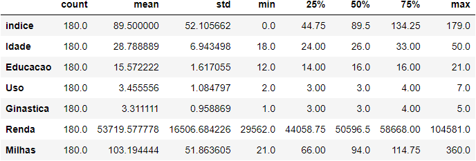

### Coloração da base de dados

    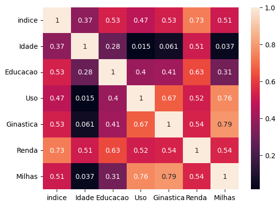

### Produtos mais usados

    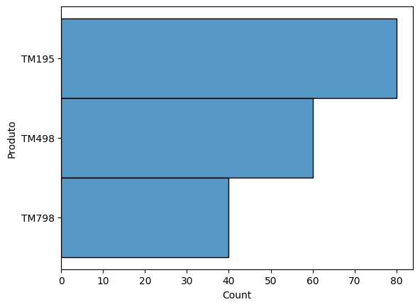

### Renda 

    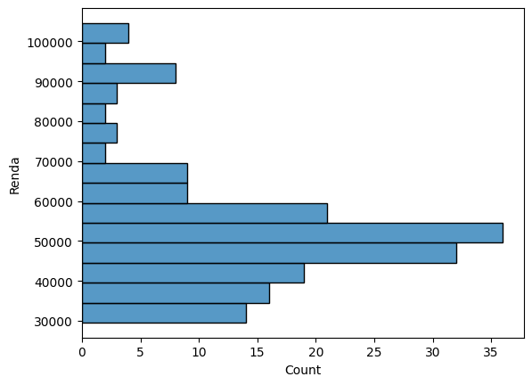

### Uso

    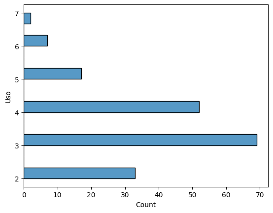

# Uso 

    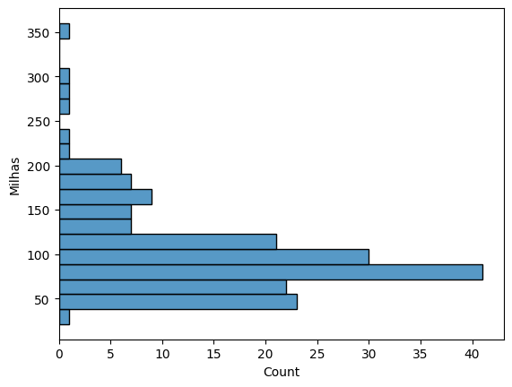

# Idade 

    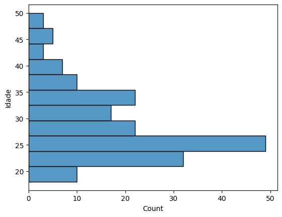

# Ginastica 

    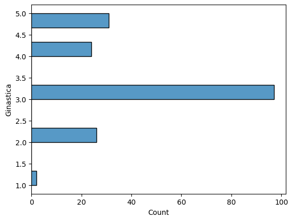

# Genero 

    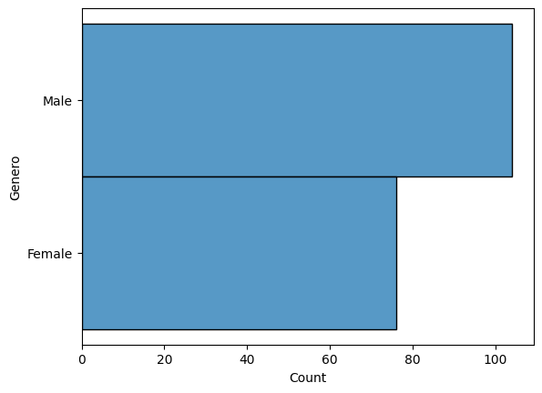

# Estado Civil 

    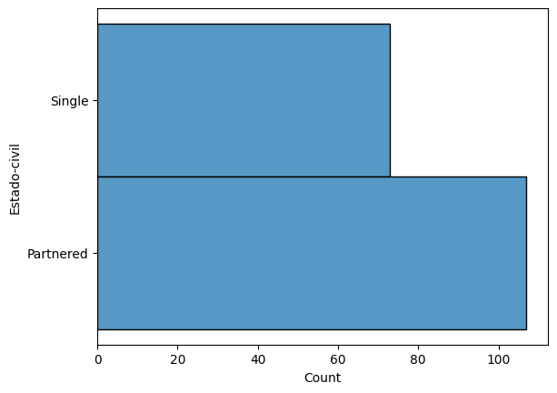

# Estado Civil 

    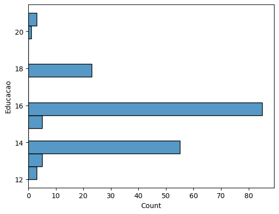

## Estrutura do projeto
------------------
    ├── LICENSE
    ├── README.md        <- The top-level README for developers using this project.
    ├── docs
    │   ├── figures     <- Figuras gráficas 
    │
    ├── requirements.txt   <- The requirements file for reproducing the analysis environment, e.g.
    │                         generated with `pip freeze > requirements.txt`
    │
    ├── src                <- Source code for use in this project-cardio.
    │   ├── __init__.py    <- Makes src a Python module
    │   │
    │   ├── data           <- Scripts to download or generate data
    │   │   └── make_dataset.py
    │   │
    │   │
    │   ├── models   <- Scripts para retorno de cálculos matemáticos  
    │   │   ├── model_predict.py
    │   │
    │   └── visualization  <- Scripts to create exploratory and results oriented visualizations
    │   │    └── visualize.py
    │   │
    │   │
    │   └── visualization  <- Scripts to create exploratory and results oriented visualizations
    │       └── visualize.py
-----------------

    Data Scient <a>Hedris</a>

