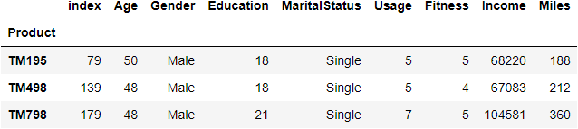

# Análise exploratória de dados/Visualização de dados

**Projeto Educacional**

### Desrição:
*este conjunto de dados contém informações de compra de esteira do cliente*

# Estrutura da base de dados

**Campos de dados:  
Produto - o modelo não. da passadeira   
Idade - no nº de anos, do cliente   
Sexo - do cliente   
Escolaridade - no nº. de anos, do cliente   
Estado Civil - do cliente   
Uso - Avg. # vezes que o cliente deseja usar a esteira toda semana   
Fitness - Pontuação de condicionamento físico auto-avaliado do cliente (5 - muito apto, 1 - muito inadequado)   
Renda - do cliente    
Milhas - esperadas para correr**   

## Descrição Estatística
-------

* Os cliente variam de 18 a 50 anos de idade.
* A idade a renda do cliente são distorcidas á direita pois a média é maior que a mediana.
* A escolaridade média dos clientes é de 15,6 anos.
O uso máximo da esteira/semana é de 7 dias, enquanto o mínimo é de apenas 2 dias.
* Os valores do 1º, 2º e 3º quartil são os mesmos para 
uso e condicionamento físico.
* A diferença entre o 3º quartlie e os valores máximos da corrida de milhas indica um número significativo de outliers

## Descrição do produto vendido

**Existem 3 Modelos de Esteira diferentes nas observações.
O número do modelo TM195 tem o maior número de observações (80).
Das 180 observações, 104 são do sexo masculino e as 76 restantes são do sexo feminino.
Foram feitas 107 observações em clientes casados.**

## Quantidade e análise dos produtos 

**Análise dos produtos mínimos com pequena escala.**

**121 / 5.000
Resultados de tradução
Dentre todos os valores mínimos, o modelo de número 'TM798' apresenta valores maiores em todas as colunas em relação aos outros dois modelos.**

**Análise maxíma dos produtos com pequena escala.**

**O modelo 'TM195' tem a idade máxima do cliente de 50 anos; também a mais baixa entre as milhas máximas percorridas.
O modelo 'TM798' tem os maiores valores de observações em Educação e Renda dos clientes; também o maior uso/semana, juntamente com as milhas percorridas e a pontuação de condicionamento físico**

**Desvio padrão em base dos produtos.**

* Renda e milhas têm maior desvio da média
* Uso e aptidão têm o menor desvio da média

## Análisando as relações entre as variáveis númericas

* Uso e milhas (muito forte)
* Miles e Fitness (muito forte)
* Uso e condicionamento físico (forte)
* Educação e renda (forte)
* Milhas e receita
* Aptidão e renda
* Uso e receita
* Idade e renda

 *Pairplot do dataframe*

## Observação de segmento dos produtos 

* O modelo 'TM195' tem um máximo de 44,4% do * total de observações

* O modelo 'TM498' tem 33,3% do total de  observações  

* O modelo 'TM798' tem o mínimo de 22,2% do total de observações feitas.

## Gênero por observação de ambos sexos

* As observações são compostas por 57,8% de clientes Masculinos e 42,2% de Clientes Femininos.

## Estado Civil

* Cerca de 59,4% dos clientes são casados e 40,6% dos clientes são solteiros.

## Idade

* A idade mínima dos clientes é 18 e a máxima é 46 com outliers variando até 50.
* A faixa interquartil (IQR) está entre 24 e 33 anos.
* A idade é uma distribuição assimétrica à direita.

    Data Scient <a>Hedris</a>

